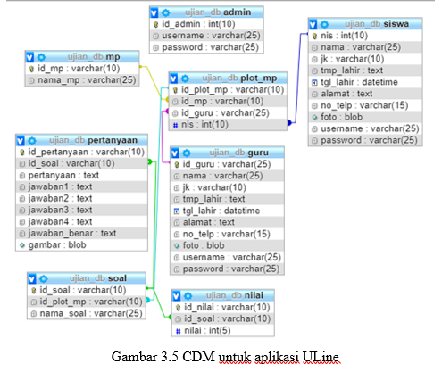

 
	<li>Software Design</li>
	<ol>
		3.1	Kebutuhan Fungsional 
		<ol>
		Kebutuhan fungsional (Functional Requirements) merupakan kebutuhan utama yang diharapkan dari aplikasi ini, yang terkait langsung dengan aplikasi. Kebutuhan fungsional dari aplikasi ini adalah sebagai berikut: 
			<ol>
				<li>Pencatatan data guru, siswa dan mata pelajaran.</li>
				<li>Pencatatan data soal ujian.</li>
				<li>Pencatatan laporan data nilai hasil ujian.</li>
			</ol>
		3.1.1 Spesifikasi yang diharapkan pada Pencatatan data guru, siswa dan mata pelajaran 
			<ol>
				<li>Sistem dapat mencatat data guru dan siswa yang telah diinputkan oleh admin.</li>
				<li>Sistem dapat mencatat data mata pelajaran beserta guru pengampunya yang telah diinputkan oleh admin.</li>
			</ol>
		3.1.2 Spesifikasi yang diharapkan pada Pencatatan data soal ujian 
			<ol>
				<li>Sistem dapat mencatat data soal ujian yang di dalamnya termasuk pertanyaan, pilihan jawaban dan jawaban benarnya.</li>
			</ol>
		3.1.3 Spesifikasi yang diharapkan pada Pencatatan data nilai hasil ujian 
			<ol>
				<li>Sistem dapat menampilkan nilai hasil ujian.</li>
				<li>Sistem dapat menampilkan review hasil ujian.</li>
			</ol>
		</ol>
		3.2	Kebutuhan Non Fungsional 
		<ol>
			Kebutuhan non fungsional merupakan kebutuhan yang mendukung kelancaran sistem yang didefnisikan sebagai berikut: 
			<ol>
				<li>Availability: online selama pelaksanaan ujian, dengan asumsi koneksi internet dan jaringan berjalan normal</li>
				<li>Reliability: sistem data reliabel berhubungan dengan data guru, siswa dan soal ujian dan juga reliabel  berhubungan dengan laporan nilai ujian.</li>
				<li>Ergonomy: user friendly dengan memperhatikan hal yang berhubungan dengan Human Computer Interaction.</li>
				<li>Portability: dapat diakses dari desktop dan mobile untuk input data dan pelaksanaan ujian karena berbasis web responsive.</li>
				<li>Memory : minimum memory untuk server aplikasi 4 Gb.</li>
				<li>Response time: tidak terukur.</li>
				<li>Security: login dan validasi password.</li>
			</ol>
		</ol>
		3.3	Kebutuhan Antarmuka (Interface) 
		<ol>
			Antarmuka dalam penerapan aplikasi ULine dibagi menjadi dua, yaitu:
			<li>Hardware Interface : adalah kebutuhan perangkat keras yang harus dipenuhi untuk implementasi sistem aplikasi ULine: 
			a. Website</li>
			<li>Software Interface :  kebutuhan software untuk implementasi sistem aplikasi ULine: 
			a. Apache 
			b. PHP 
			c. MYSQL</li>
		</ol>
		3.4	Lingkungan Operasi 
		<ol>
			Aplikasi akan berfungsi dengan lingkungan operasi sebagai berikut: 
			<ol>
				<li>Sistem Operasi		: minimal windows dan android</li>
				<li>DBMS				: berbasis SQL</li>
				<li>Pemrograman			: PHP, HTML, dan Java</li>
			</ol>
		</ol>
		3.5	Batasan Perancangan 
		<ol>
			Perancangan sistem aplikasi ULine ini adalah berbasis website untuk admin, guru dalam pengolahan data dan berbasis website untuk siswa dalam pengerjaan ujian. Bahasa pemrograman yang digunakan adalah PHP,HTML dan Java.
		</ol>
		3.6	Model Proses 
		<ol>
		Untuk menggambarkan pemodelan proses digunakan DFD (Data Flow Diagram), yang untuk masing- masing level akan digambarkan sebagai berikut: 
			<ol>
			3.6.1 DFD Level 0 (Context Diagram) 
			Dalam perancangan DFD level 0, entitas eksternal yang terlibat adalah:  
			<ol>
				<li>Admin</li>
				<li>Guru</li>
				<li>Siswa</li>
			</ol>
			

			3.6.2 DFD Level 1 
			Pada DFD level 1, proses-proses yang didekomposisi dari DFD level 0 yaitu: 
			<ol>
				<li>Proses Login</li>
				<li>Proses Pengelolaan</li>
				<li>Proses Ujian</li>
				<li>Proses Laporan</li>
			</ol>
			Yang masing-masing entitas dan prosesnya dapat digambarkan sebagai berikut: 
			

			3.6.3 DFD Level 2 
			Proses-proses yang perlu didekomposisi dari DFD level 1 yaitu Proses Pengelolaan, Ujian dan Laporan, dimana proses hasil dekomposisinya adalah sebagai berikut: 
			

			

			</ol>
		</ol>
		3.7	Model Data 
		<ol>
			Pemodelan data untuk aplikasi ULine ini digambarkan dalam conseptual data model pada diagram ER (Entity Relationship) berikut : 
			

		</ol>
		3.8	Data Structures 
		<ol>
			Bagian ini akan menjelaskan struktur data. Tabel yang dibuat ada 8 (delapan) dengan nama masing masing tabelnya adalah sebagai berikut: 
			<ol>
				<li>Tabel admin</li>
				<li>Tabel guru</li>
				<li>Tabel siswa</li>
				<li>Tabel mata pelajaran</li>
				<li>Tabel plot mata pelajaran</li>
				<li>Tabel soal</li>
				<li>Tabel pertanyaan</li>
				<li>Tabel nilai</li>
			</ol>
			Penjelasan fungsi masing-masing tabel diatas adalah sebagai berikut : 
			Tabel admin digunakan untuk menyimpan data admin, admin dapat mengelola data guru, siswa dan mata pelajaran. 
			<table>
				<tr>
					<td>Nama Field</td>
					<td>Tipe</td>
					<td>Keterangan</td>
				</tr>
				<tr>
					<td>id_admin</td>
					<td>Int(10)</td>
					<td>Untuk meyimpan id admin</td>
				</tr>
				<tr>
					<td>username</td>
					<td>Varchar(25)</td>
					<td>Untuk menyimpan username admin</td>
				</tr>
				<tr>
					<td>password</td>
					<td>Varchar(25)</td>
					<td>Untuk menyimpan password admin</td>
				</tr>
			</table> 
			Tabel guru digunakan untuk menyimpan data guru, guru dapat mengelola data soal dan nilai sesuai dengan mata pelajaran yang diampu. 
			<table>
				<tr>
					<td>Nama Field</td>
					<td>Tipe</td>
					<td>Keterangan</td>
				</tr>
				<tr>
					<td>id_guru</td>
					<td>Varchar(25)</td>
					<td>Untuk meyimpan id guru</td>
				</tr>
				<tr>
					<td>nama</td>
					<td>Varchar(25)</td>
					<td>Untuk meyimpan nama guru</td>
				</tr>
				<tr>
					<td>jk</td>
					<td>Varchar(10)</td>
					<td>Untuk menyimpan data jenis kelamin guru</td>
				</tr>
				<tr>
					<td>tmp_lahir</td>
					<td>Text</td>
					<td>Untuk menyimpan tempat lahir guru</td>
				</tr>
				<tr>
					<td>tgl_lahir</td>
					<td>Datetime</td>
					<td>Untuk menyimpan tanggal lahir guru</td>
				</tr>
				<tr>
					<td>alamat</td>
					<td>Text</td>
					<td>Untuk menyimpan alamat guru</td>
				</tr>
				<tr>
					<td>no_telp</td>
					<td>Varchar(15)</td>
					<td>Untuk menyimpan nomor telepon guru</td>
				</tr>
				<tr>
					<td>foto</td>
					<td>Blob</td>td>
					<td>Untuk menyimpan foto guru</td>
				</tr>
				<tr>
					<td>username</td>
					<td>Varchar(25)</td>
					<td>Untuk menyimpan username guru</td>
				</tr>
				<tr>
					<td>password</td>
					<td>Varchar(25)</td>
					<td>Untuk menyimpan password guru</td>
				</tr>
			</table> 
			Tabel siswa digunakan untuk menyimpan data siswa, siswa sebagai subyek utama dalam pelaksanaan ujian. 
			<table>
				<tr>
					<td>Nama Field</td>
					<td>Tipe</td>
					<td>Keterangan</td>
				</tr>
				<tr>
					<td>nis</td>
					<td>Int(10)</td>
					<td>Untuk meyimpan nomor induk siswa</td>
				</tr>
				<tr>
					<td>nama</td>
					<td>Varchar(25)</td>
					<td>Untuk meyimpan nama siswa</td>
				</tr>
				<tr>
					<td>jk</td>
					<td>Varchar(10)</td>
					<td>Untuk menyimpan data jenis kelamin siswa</td>
				</tr>
				<tr>
					<td>tmp_lahir</td>
					<td>Text</td>
					<td>Untuk menyimpan tempat lahir siswa</td>
				</tr>
				<tr>
					<td>tgl_lahir</td>
					<td>Datetime</td>
					<td>Untuk menyimpan tanggal lahir siswa</td>
				</tr>
				<tr>
					<td>alamat</td>
					<td>Text</td>
					<td>Untuk menyimpan alamat siswa</td>
				</tr>
				<tr>
					<td>no_telp</td>
					<td>Varchar(15)</td>
					<td>Untuk menyimpan nomor telepon siswa</td>
				</tr>
				<tr>
					<td>foto</td>
					<td>Blob</td>
					<td>Untuk menyimpan foto siswa</td>
				</tr>
				<tr>
					<td>username</td>
					<td>Varchar(25)</td>
					<td>Untuk menyimpan username siswa</td>
				</tr>
				<tr>
					<td>password</td>
					<td>Varchar(25)</td>
					<td>Untuk menyimpan password siswa</td>
				</tr>
			</table> 
			Tabel mata pelajaran digunakan untuk menyimpan data mata pelajaran. 
			<table>
				<tr>
					<td>Nama Field</td>
					<td>Tipe</td>
					<td>Keterangan</td>
				</tr>
				<tr>
					<td>id_mp</td>
					<td>varchar(10)</td>
					<td>Untuk meyimpan id mata pelajaran</td>
				</tr>
				<tr>
					<td>nama_mp</td>
					<td>Varchar(25)</td>
					<td>Untuk menyimpan nama mata pelajaran</td>
				</tr>
			</table> 
			Tabel plot mata pelajaran digunakan untuk menyimpan data plot mata pelajaran. 
			<table>
				<tr>
					<td>Nama Field</td>
					<td>Tipe</td>
					<td>Keterangan</td>
				</tr>
				<tr>
					<td>id_plot_mp</td>
					<td>varcahr(10)</td>
					<td>Untuk meyimpan id plot mata pelajaran</td>
				</tr>
				<tr>
					<td>id_mp</td>
					<td>Varchar(10)</td>
					<td>Untuk meyimpan id mata pelajaran</td>
				</tr>
				<tr>
					<td>id_guru</td>
					<td>Varchar(25)</td>
					<td>Untuk meyimpan id guru</td>
				</tr>
				<tr>
					<td>nis</td>
					<td>Int(10)</td>
					<td>Untuk meyimpan nomor induk siswa</td>
				</tr>
			</table> 
			Tabel soal digunakan untuk menyimpan data soal setiap mata pelajaran yang diujikan. 
			<table>
				<tr>
					<td>Nama Field</td>
					<td>Tipe</td>
					<td>Keterangan</td>
				</tr>
				<tr>
					<td>id_soal</td>
					<td>varchar(10)</td>
					<td>Untuk meyimpan id soal</td>
				</tr>
				<tr>
					<td>id_plot_mp</td>
					<td>varchar(10)</td>
					<td>Untuk menyimpan id plot mata pelajaran</td>
				</tr>
				<tr>
					<td>nama_soal</td>
					<td>Varchar(25)</td>
					<td>Untuk menyimpan nama soal</td>
				</tr>
			</table> 
			Tabel pertanyaan digunakan untuk menyimpan data pertanyaan, pilihan jawaban dan jawaban benarnya dari setiap soal. 
			<table>
				<tr>
					<td>Nama Field</td>
					<td>Tipe</td>
					<td>Keterangan</td>
				</tr>
				<tr>
					<td>id_pertanyaan</td>
					<td>varchar(10)</td>
					<td>Untuk meyimpan id pertanyaan</td>
				</tr>
				<tr>
					<td>id_soal</td>
					<td>Varchar(10)</td>
					<td>Untuk meyimpan id soal</td>
				</tr>
				<tr>
					<td>pertanyaan</td>
					<td>Text</td>
					<td>Untuk menyimpan pertanyaan</td>
				</tr>
				<tr>
					<td>jawaban1</td>
					<td>Text</td>
					<td>Untuk menyimpan pilihan jawaban 1</td>
				</tr>
				<tr>
					<td>jawaban2</td>
					<td>Text</td>
					<td>Untuk menyimpan pilihan jawaban 2</td>
				</tr>
				<tr>
					<td>jawaban3</td>
					<td>Text</td>
					<td>Untuk menyimpan pilihan jawaban 3</td>
				</tr>
				<tr>
					<td>jawaban_benar</td>
					<td>Text</td>
					<td>Untuk menyimpan jawaban benar</td>
				</tr>
				<tr>
					<td>Gambar</td>
					<td>Blob</td>
					<td>Untuk menyimpan gambar pada pertanyaan</td>
				</tr>
			</table> 
			Tabel nilai digunakan untuk menyimpan data nilai dari hasil ujian siswa. 
			<table>
				<tr>
					<td>Nama Field</td>
					<td>Tipe</td>
					<td>Keterangan</td>
				</tr>
				<tr>
					<td>id_nilai</td>
					<td>varchar(10)</td>
					<td>Untuk meyimpan id nilai</td>
				</tr>
				<tr>
					<td>id_soal</td>
					<td>Varchar(10)</td>
					<td>Untuk menyimpan id soal</td>
				</tr>
				<tr>
					<td>Nilai</td>
					<td>Int(5)</td>
					<td>Untuk menyimpan nilai hasil ujian</td>
				</tr>
			</table> 
		</ol>
		3.9	Program Spesification 
		<ol>
			Dari hasil DFD didapatkan 8 (delapan) proses, yaitu: 
			<ol>
				<li>Proses Login</li>
				<li>Proses Pengelolaan</li>
				<li>Proses Ujian</li>
				<li>Proses Laporan</li>
			</ol>
			Untuk masing-masing proses, spesifikasi programnya dapat dituliskan sebagai berikut: 
			<table>
				<tr>
					<td>Proses</td>
					<td>Spesifikasi Program</td>
				</tr>
				<tr>
					<td>Proses Login</td>
					<td>Jika admin, guru dan siswa klik login lalu tampil data admin, guru dan siswa.</td>
				</tr>
				<tr>
					<td>Proses Pengelolaan</td>
					<td>Jika admin klik tambah, hapus atau edit data mata pelajaran, guru dan siswa maka tampil tabel mata pelajaran, guru dan siswa. 
					Jika admin klik tambah, hapus atau edit akun guru dan siswa kemudian tampil tabel guru dan siswa. 
					Jika guru klik tambah, hapus atau edit data soal ujian atau jadwal ujian maka tampil tabel mata pelajaran, soal dan pertanyaan.</td>
				</tr>
				<tr>
					<td>Proses Ujian</td>
					<td>Jika siswa pilih kelas dan mata pelajaran maka tampil data mata pelajaran dan kelas siswa. 
					Jika siswa pilih kerjakan ujian maka akan tampil soal ujian berupa pertanyaan dan pilihan jawaban ujian.</td>
				</tr>
				<tr>
					<td>Proses Laporan</td>
					<td>Jika siswa telah selesai mengerjakan ujian dan klik submit maka akan tampil laporan nilai hasil ujian siswa.</td>
				</tr>
			</table> 
		</ol>
		3.10 Interface Design 
		<ol>
		Bagian ini akan menjelaskan bagaimana interface (antarmuka), berupa Page (halaman website) untuk interaksi user dan komputer akan direncanakan, yang meliputi : 
		<ol>
		<li>Desain untuk Page Input</li>
		<li>Desain untuk Page View</li>
		<li>Desain untuk Front Page</li> 
		</ol>
		3.10.1 Input Page Design 
		<ol>
			Desain page input merupakan semua page input yang digunakan pada aplikasi ULine ini, yaitu meliputi : 
			<li>Page Login 
			Halaman ini digunakan untuk login admin, guru, dan siswa. 
			

</li>	
			<li>Page input data mata pelajaran Halaman ini digunakan untuk input data mata pelajaran.</li>
			<li>Page input data guru 
			Halaman ini digunakan untuk input data guru.</li>
			<li>Page input data siswa 
			Halaman ini digunakan untuk input data siswa.</li>
			<li>Page input data soal 
			Halaman ini digunakan untuk input data soal.</li>
			<li>Page input data pertanyaan beserta jawabannya 
			Halaman ini digunakan untuk input data pertanyaan dan jawabannya.</li>
			<li>Page input jawaban ujian oleh siswa Halaman ini yang digunakan oleh siswa dalam mengerjakan ujian. 
			

</li>
		</ol>
			3.10.2 View Page Design 
			<ol>
				<li>Page akun guru 
				Halaman ini digunakan untuk menampilkan akun guru. 
				

</li>
				<li>Page akun siswa 
				Halaman ini digunakan untuk menampilkan akun siswa. 
				

</li>
				<li>Page Ujian 
				Halaman ini digunakan untuk menampilkan soal ujian ketika ujian sedang berlangsung. 
				

</li>
				<li>Page Review Hasil Ujian 
				Halaman ini digunakan untuk menampilkan review hasil ujian beserta nilai ujian.</li>
			</ol>
			3.10.3 Front Page Design 
			<ol>
				Interface ini merupakan halaman utama dari website admin, guru dan siswa pada aplikasi ULine.
				<ol>
					<li>Front Page admin 
					

</li>
					<li>Front Page guru 
					

</li>
					<li>Front Page siswa 
					

</li>
				</ol>
			</ol>
		</ol>
	</ol>
</ol>
